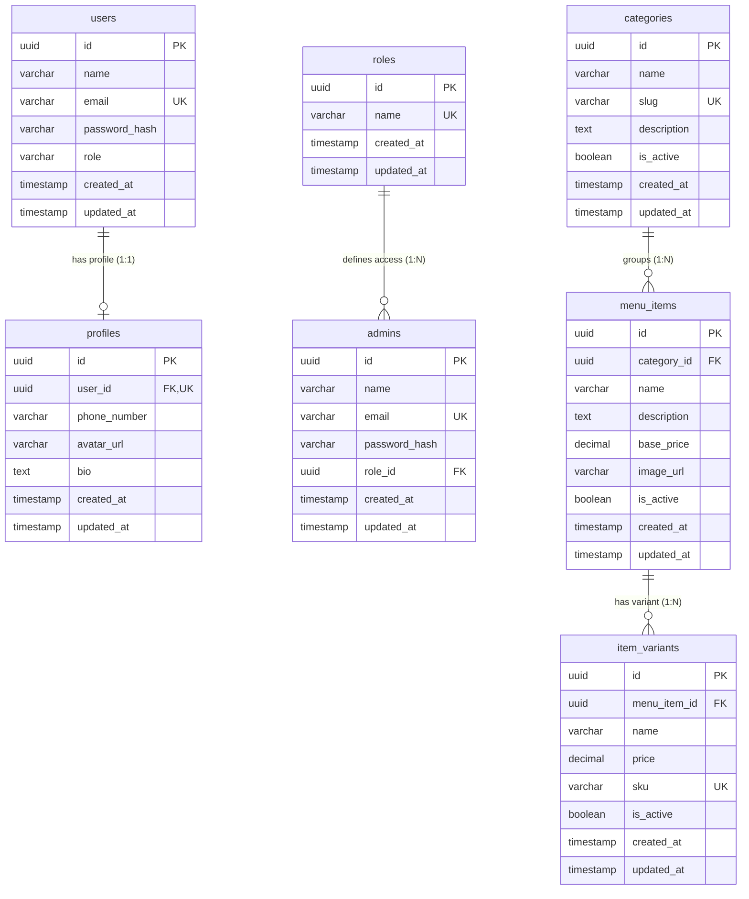

# Database Schema & API Reference Documentation

This document serves as an architectural blueprint and future reference for the database tables, relationships, and administrative APIs within the Bean Club backend application.

---

## 📊 Entity Relationship (ER) Diagram

The following diagram illustrates the relational layout, foreign key links, and cardinality definitions:



---

## 🗄️ Database Tables Specification

### 1. `users` (Customers)
Represents customer authentication profiles.
* **`id`** (`uuid`): Primary key, auto-generated UUID.
* **`name`** (`varchar(100)`): Customer's name. Not null.
* **`email`** (`varchar(255)`): Unique customer email for login. Not null.
* **`passwordHash`** (`varchar(255)`): Hashed password value. Not null.
* **`role`** (`varchar(50)`): Set to `"user"` by default. Not null.
* **`createdAt` / `updatedAt`** (`timestamp`): Audit dates. Defaults to current time.

### 2. `profiles`
Detailed profile metadata linked to customers.
* **`id`** (`uuid`): Primary key, auto-generated UUID.
* **`userId`** (`uuid`): Foreign key referencing `users.id`. Unique (1-to-1 constraint). Deletes cascade if user is removed.
* **`phoneNumber`** (`varchar(20)`): Customer's phone number. Nullable.
* **`avatarUrl`** (`varchar(255)`): Profile photo link. Nullable.
* **`bio`** (`text`): Short customer profile bio. Nullable.
* **`createdAt` / `updatedAt`** (`timestamp`): Audit dates. Defaults to current time.

### 3. `roles` (RBAC Classifications)
Lists administrative role names.
* **`id`** (`uuid`): Primary key, auto-generated UUID.
* **`name`** (`varchar(50)`): Unique role descriptor. Populated roles are:
  - `"kitchen"`: Kitchen display staff.
  - `"admin"`: Standard store administrator.
  - `"superadmin"`: Master system administrator.
* **`createdAt` / `updatedAt`** (`timestamp`): Audit dates. Defaults to current time.

### 4. `admins`
Internal store staff/administrative login credentials.
* **`id`** (`uuid`): Primary key, auto-generated UUID.
* **`name`** (`varchar(100)`): Administrator's name. Not null.
* **`email`** (`varchar(255)`): Unique corporate email address. Not null.
* **`passwordHash`** (`varchar(255)`): Hashed credentials. Not null.
* **`roleId`** (`uuid`): Foreign key referencing `roles.id`. Not null.
* **`createdAt` / `updatedAt`** (`timestamp`): Audit dates. Defaults to current time.

### 5. `categories`
Groups for grouping food/beverage menus.
* **`id`** (`uuid`): Primary key, auto-generated UUID.
* **`name`** (`varchar(100)`): Category label (e.g. "Burgers", "Cold Brews"). Not null.
* **`slug`** (`varchar(100)`): Unique URL-friendly slug. Auto-slugified on creation if not provided (e.g. "cold-brews"). Not null.
* **`description`** (`text`): Category summary. Nullable.
* **`isActive`** (`boolean`): Active indicator. Defaults to `true`. Not null.
* **`createdAt` / `updatedAt`** (`timestamp`): Audit dates. Defaults to current time.

### 6. `menu_items`
Food/beverage items listed on the active menu.
* **`id`** (`uuid`): Primary key, auto-generated UUID.
* **`categoryId`** (`uuid`): Foreign key referencing `categories.id`. Cascades on delete. Not null.
* **`name`** (`varchar(100)`): Menu item name. Unique within its category. Not null.
* **`description`** (`text`): Description. Nullable.
* **`basePrice`** (`decimal(10,2)`): Core item price stored with 2-decimal precision. Not null.
* **`imageUrl`** (`varchar(255)`): Image resource URL. Nullable.
* **`isActive`** (`boolean`): Active indicator. Defaults to `true`. Not null.
* **`createdAt` / `updatedAt`** (`timestamp`): Audit dates. Defaults to current time.

### 7. `item_variants`
Variants (sizes/options) for menu items.
* **`id`** (`uuid`): Primary key, auto-generated UUID.
* **`menuItemId`** (`uuid`): Foreign key referencing `menu_items.id`. Cascades on delete. Not null.
* **`name`** (`varchar(50)`): Variant name (e.g. "Small", "Large", "Soy Milk"). Not null.
* **`price`** (`decimal(10,2)`): Variant specific price. Not null.
* **`sku`** (`varchar(100)`): Unique SKU code. Nullable.
* **`isActive`** (`boolean`): Active indicator. Defaults to `true`. Not null.
* **`createdAt` / `updatedAt`** (`timestamp`): Audit dates. Defaults to current time.

---

## 🛡️ Administrative APIs Specification

All endpoints are mounted under `/api/v1/admin`.

### 1. Admin Login
* **Endpoint**: `POST /auth/login`
* **Access**: Public
* **Payload**:
  ```json
  {
    "email": "superadmin@beanclub.com",
    "password": "superadmin123"
  }
  ```
* **Success Response (200)**:
  ```json
  {
    "success": true,
    "statusCode": 200,
    "result": {
      "admin": {
        "id": "e0a6d0c9-4b16-4392-bd74-123456789abc",
        "name": "Default Super Admin",
        "email": "superadmin@beanclub.com",
        "role": "superadmin"
      },
      "token": "eyJhbGciOiJIUzI1NiIsInR5cCI6IkpXVCJ9..."
    },
    "message": "Admin logged in successfully"
  }
  ```

### 2. Category Creation
* **Endpoint**: `POST /categories`
* **Access**: Protected (Requires Header `Authorization: Bearer <token>` where role is `"admin"` or `"superadmin"`)
* **Payload**:
  ```json
  {
    "name": "Hot Beverages",
    "slug": "hot-beverages", // Optional. Auto-generated if omitted
    "description": "Premium coffees and loose-leaf teas served hot"
  }
  ```
* **Success Response (210)**:
  ```json
  {
    "success": true,
    "statusCode": 201,
    "result": {
      "category": {
        "id": "b3e34ab5-cb78-43d9-95ab-abcdef123456",
        "name": "Hot Beverages",
        "slug": "hot-beverages",
        "description": "Premium coffees and loose-leaf teas served hot",
        "isActive": true,
        "createdAt": "2026-06-03T11:08:48.000Z",
        "updatedAt": "2026-06-03T11:08:48.000Z"
      }
    },
    "message": "Category created successfully"
  }
  ```

### 3. Menu Item Creation
* **Endpoint**: `POST /menu-items`
* **Access**: Protected (Requires Header `Authorization: Bearer <token>` where role is `"admin"` or `"superadmin"`)
* **Payload**:
  ```json
  {
    "categoryId": "b3e34ab5-cb78-43d9-95ab-abcdef123456",
    "name": "Cappuccino",
    "description": "Espresso with steamed milk foam",
    "basePrice": 4.50,
    "imageUrl": "https://example.com/cappuccino.png" // Optional
  }
  ```
* **Success Response (201)**:
  ```json
  {
    "success": true,
    "statusCode": 201,
    "result": {
      "menuItem": {
        "id": "f83db2ce-23da-4a5e-85a2-987654321def",
        "categoryId": "b3e34ab5-cb78-43d9-95ab-abcdef123456",
        "name": "Cappuccino",
        "description": "Espresso with steamed milk foam",
        "basePrice": "4.50",
        "imageUrl": "https://example.com/cappuccino.png",
        "isActive": true,
        "createdAt": "2026-06-03T11:08:48.000Z",
        "updatedAt": "2026-06-03T11:08:48.000Z"
      }
    },
    "message": "Menu item created successfully"
  }
  ```

### 4. Menu Item Variant Creation
* **Endpoint**: `POST /menu-items/variants`
* **Access**: Protected (Requires Header `Authorization: Bearer <token>` where role is `"admin"` or `"superadmin"`)
* **Payload**:
  ```json
  {
    "menuItemId": "f83db2ce-23da-4a5e-85a2-987654321def",
    "name": "Large",
    "price": 5.50,
    "sku": "CAP-LG-001" // Optional
  }
  ```
* **Success Response (201)**:
  ```json
  {
    "success": true,
    "statusCode": 201,
    "result": {
      "itemVariant": {
        "id": "a1b2c3d4-e5f6-7a8b-9c0d-1234567890ab",
        "menuItemId": "f83db2ce-23da-4a5e-85a2-987654321def",
        "name": "Large",
        "price": "5.50",
        "sku": "CAP-LG-001",
        "isActive": true,
        "createdAt": "2026-06-03T11:14:12.000Z",
        "updatedAt": "2026-06-03T11:14:12.000Z"
      }
    },
    "message": "Item variant created successfully"
  }
  ```

### 5. Get All System Roles
* **Endpoint**: `GET /roles`
* **Access**: Protected (Requires Header `Authorization: Bearer <token>` where role is `"admin"` or `"superadmin"`)
* **Success Response (200)**:
  ```json
  {
    "success": true,
    "statusCode": 200,
    "result": {
      "roles": [
        {
          "id": "f83db2ce-23da-4a5e-85a2-987654321def",
          "name": "kitchen",
          "createdAt": "2026-06-03T11:08:48.000Z",
          "updatedAt": "2026-06-03T11:08:48.000Z"
        },
        {
          "id": "a1b2c3d4-e5f6-7a8b-9c0d-1234567890ab",
          "name": "admin",
          "createdAt": "2026-06-03T11:08:48.000Z",
          "updatedAt": "2026-06-03T11:08:48.000Z"
        },
        {
          "id": "c7b8a9d0-e1f2-3a4b-5c6d-7e8f90abcdef",
          "name": "superadmin",
          "createdAt": "2026-06-03T11:08:48.000Z",
          "updatedAt": "2026-06-03T11:08:48.000Z"
        }
      ]
    },
    "message": "Roles retrieved successfully"
  }
  ```

### 6. Get All Administrators
* **Endpoint**: `GET /admins`
* **Access**: Protected (Requires Header `Authorization: Bearer <token>` where role is `"admin"` or `"superadmin"`)
* **Query Params**:
  * `page` (optional): Current page (default `1`)
  * `perPage` (optional): Records per page (default `10`)
  * `name` (optional): Filter by name or email
* **Success Response (200)**:
  ```json
  {
    "success": true,
    "statusCode": 200,
    "result": {
      "admins": [
        {
          "id": "e0a6d0c9-4b16-4392-bd74-123456789abc",
          "name": "Default Super Admin",
          "email": "superadmin@beanclub.com",
          "roleId": "c7b8a9d0-e1f2-3a4b-5c6d-7e8f90abcdef",
          "isActive": true,
          "createdAt": "2026-06-03T11:08:48.000Z",
          "updatedAt": "2026-06-03T11:08:48.000Z",
          "role": {
            "id": "c7b8a9d0-e1f2-3a4b-5c6d-7e8f90abcdef",
            "name": "superadmin"
          }
        }
      ],
      "pagination": {
        "totalItems": 1,
        "totalPages": 1,
        "currentPage": 1,
        "perPage": 10
      }
    },
    "message": "Administrators retrieved successfully"
  }
  ```

### 7. Create New Administrator
* **Endpoint**: `POST /admins`
* **Access**: Protected (Requires Header `Authorization: Bearer <token>` where role is `"admin"` or `"superadmin"`)
* **Payload**:
  ```json
  {
    "name": "Jane Smith",
    "email": "jane@beanclub.com",
    "password": "securepassword123",
    "roleId": "a1b2c3d4-e5f6-7a8b-9c0d-1234567890ab"
  }
  ```
* **Success Response (201)**:
  ```json
  {
    "success": true,
    "statusCode": 201,
    "result": {
      "admin": {
        "id": "b3e34ab5-cb78-43d9-95ab-abcdef123456",
        "name": "Jane Smith",
        "email": "jane@beanclub.com",
        "roleId": "a1b2c3d4-e5f6-7a8b-9c0d-1234567890ab",
        "isActive": true,
        "createdAt": "2026-06-07T11:00:00.000Z",
        "updatedAt": "2026-06-07T11:00:00.000Z",
        "role": {
          "id": "a1b2c3d4-e5f6-7a8b-9c0d-1234567890ab",
          "name": "admin"
        }
      }
    },
    "message": "Administrator created successfully"
  }
  ```

### 8. Update Administrator
* **Endpoint**: `PUT /admins/:id`
* **Access**: Protected (Requires Header `Authorization: Bearer <token>` where role is `"admin"` or `"superadmin"`)
* **Payload**:
  ```json
  {
    "name": "Jane Doe",
    "email": "janedoe@beanclub.com",
    "password": "newsecurepassword123", // Optional
    "roleId": "c7b8a9d0-e1f2-3a4b-5c6d-7e8f90abcdef", // Optional
    "isActive": false // Optional
  }
  ```
* **Success Response (200)**:
  ```json
  {
    "success": true,
    "statusCode": 200,
    "result": {
      "admin": {
        "id": "b3e34ab5-cb78-43d9-95ab-abcdef123456",
        "name": "Jane Doe",
        "email": "janedoe@beanclub.com",
        "roleId": "c7b8a9d0-e1f2-3a4b-5c6d-7e8f90abcdef",
        "isActive": false,
        "createdAt": "2026-06-07T11:00:00.000Z",
        "updatedAt": "2026-06-07T11:05:00.000Z",
        "role": {
          "id": "c7b8a9d0-e1f2-3a4b-5c6d-7e8f90abcdef",
          "name": "superadmin"
        }
      }
    },
    "message": "Administrator updated successfully"
  }
  ```

### 9. Delete Administrator
* **Endpoint**: `DELETE /admins/:id`
* **Access**: Protected (Requires Header `Authorization: Bearer <token>` where role is `"admin"` or `"superadmin"`)
* **Success Response (200)**:
  ```json
  {
    "success": true,
    "statusCode": 200,
    "result": {
      "id": "b3e34ab5-cb78-43d9-95ab-abcdef123456"
    },
    "message": "Administrator deleted successfully"
  }
  ```

