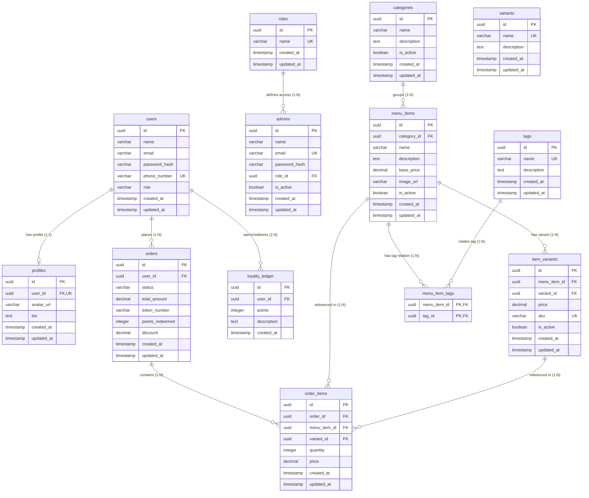

# Database Schema & API Reference Documentation

This document serves as an architectural blueprint and future reference for the database tables, relationships, and APIs (both administrative and customer-facing) within the Bean Club backend application.

---

## 📊 Entity Relationship (ER) Diagram

The following diagram illustrates the relational layout, foreign key links, and cardinality definitions:



---

## 🗄️ Database Tables Specification

### 1. `users` (Customers)
Represents customer authentication and contact profiles.
* **`id`** (`uuid`): Primary key, auto-generated UUID.
* **`name`** (`varchar(100)`): Customer's display name. Not null.
* **`email`** (`varchar(255)`): Customer's email. Nullable (optional for password-less guests).
* **`passwordHash`** (`varchar(255)`): Hashed password value. Nullable.
* **`phoneNumber`** (`varchar(20)`): Customer's phone number. Unique. Not null.
* **`role`** (`varchar(50)`): Authorization role, defaults to `"user"`. Not null.
* **`createdAt` / `updatedAt`** (`timestamp`): Audit dates. Defaults to current time.

### 2. `profiles`
Detailed profile metadata linked to customers.
* **`id`** (`uuid`): Primary key, auto-generated UUID.
* **`userId`** (`uuid`): Foreign key referencing `users.id`. Unique (1-to-1 constraint). Cascades on delete. Not null.
* **`avatarUrl`** (`varchar(255)`): Profile photo link. Nullable.
* **`bio`** (`text`): Short customer profile bio. Nullable.
* **`createdAt` / `updatedAt`** (`timestamp`): Audit dates. Defaults to current time.

### 3. `roles` (RBAC Classifications)
Lists administrative role names.
* **`id`** (`uuid`): Primary key, auto-generated UUID.
* **`name`** (`varchar(50)`): Unique role descriptor (e.g., `"kitchen"`, `"admin"`, `"superadmin"`). Not null.
* **`createdAt` / `updatedAt`** (`timestamp`): Audit dates. Defaults to current time.

### 4. `admins`
Internal store staff/administrative login credentials.
* **`id`** (`uuid`): Primary key, auto-generated UUID.
* **`name`** (`varchar(100)`): Administrator's name. Not null.
* **`email`** (`varchar(255)`): Unique corporate email address. Not null.
* **`passwordHash`** (`varchar(255)`): Hashed credentials. Not null.
* **`roleId`** (`uuid`): Foreign key referencing `roles.id`. Not null.
* **`isActive`** (`boolean`): Active indicator. Defaults to `true`. Not null.
* **`createdAt` / `updatedAt`** (`timestamp`): Audit dates. Defaults to current time.

### 5. `categories`
Groups for categorizing food/beverage menus.
* **`id`** (`uuid`): Primary key, auto-generated UUID.
* **`name`** (`varchar(100)`): Category label (e.g. "Burgers", "Cold Brews"). Not null.
* **`description`** (`text`): Category summary. Nullable.
* **`isActive`** (`boolean`): Active indicator. Defaults to `true`. Not null.
* **`createdAt` / `updatedAt`** (`timestamp`): Audit dates. Defaults to current time.

### 6. `menu_items`
Food/beverage items listed on the active menu.
* **`id`** (`uuid`): Primary key, auto-generated UUID.
* **`categoryId`** (`uuid`): Foreign key referencing `categories.id`. Sets null on delete.
* **`name`** (`varchar(100)`): Menu item name. Unique within its category. Not null.
* **`description`** (`text`): Description. Nullable.
* **`basePrice`** (`decimal(10,2)`): Core item price. Not null.
* **`imageUrl`** (`varchar(255)`): Image resource URL. Nullable.
* **`isActive`** (`boolean`): Active indicator. Defaults to `true`. Not null.
* **`createdAt` / `updatedAt`** (`timestamp`): Audit dates. Defaults to current time.

### 7. `tags`
Categorization labels for menu items (e.g., "Vegan", "Chef's Special").
* **`id`** (`uuid`): Primary key, auto-generated UUID.
* **`name`** (`varchar(50)`): Unique tag name. Not null.
* **`description`** (`text`): Optional summary. Nullable.
* **`createdAt` / `updatedAt`** (`timestamp`): Audit dates. Defaults to current time.

### 8. `menu_item_tags`
Many-to-many join table connecting menu items to tags.
* **`menuItemId`** (`uuid`): Foreign key referencing `menu_items.id`. Cascades on delete. Not null.
* **`tagId`** (`uuid`): Foreign key referencing `tags.id`. Cascades on delete. Not null.
* **Primary Key**: Composite of `(menuItemId, tagId)`.

### 9. `variants`
Master options catalog for customization (e.g., "Regular", "Large", "Soy Milk").
* **`id`** (`uuid`): Primary key, auto-generated UUID.
* **`name`** (`varchar(50)`): Unique customization name. Not null.
* **`description`** (`text`): Optional description. Nullable.
* **`createdAt` / `updatedAt`** (`timestamp`): Audit dates. Defaults to current time.

### 10. `item_variants`
Pricing mappings representing specific customized variants for a menu item.
* **`id`** (`uuid`): Primary key, auto-generated UUID.
* **`menuItemId`** (`uuid`): Foreign key referencing `menu_items.id`. Cascades on delete. Not null.
* **`variantId`** (`uuid`): Foreign key referencing `variants.id`. Cascades on delete. Not null.
* **`price`** (`decimal(10,2)`): Price of this specific variant. Not null.
* **`sku`** (`varchar(100)`): Unique SKU code. Nullable.
* **`isActive`** (`boolean`): Active indicator. Defaults to `true`. Not null.
* **`createdAt` / `updatedAt`** (`timestamp`): Audit dates. Defaults to current time.
* **Index**: Unique combination of `(menuItemId, variantId)`.

### 11. `orders`
Represents client checkout transactions.
* **`id`** (`uuid`): Primary key, auto-generated UUID.
* **`userId`** (`uuid`): Foreign key referencing `users.id`. Cascades on delete. Not null.
* **`status`** (`varchar(50)`): Current state (e.g., `"pending"`, `"preparing"`, `"completed"`, `"cancelled"`). Defaults to `"pending"`. Not null.
* **`totalAmount`** (`decimal(10,2)`): Final invoice total after loyalty point offset and including 5% tax. Not null.
* **`tokenNumber`** (`varchar(50)`): Random 4-digit verification code for pickup counter tracking. Nullable.
* **`pointsRedeemed`** (`integer`): Number of loyalty points utilized for discount. Defaults to `0`. Not null.
* **`discount`** (`decimal(10,2)`): Calculated discount cash offset value. Defaults to `0.00`. Not null.
* **`createdAt` / `updatedAt`** (`timestamp`): Audit dates. Defaults to current time.

### 12. `order_items`
Relational line items inside a specific order.
* **`id`** (`uuid`): Primary key, auto-generated UUID.
* **`orderId`** (`uuid`): Foreign key referencing `orders.id`. Cascades on delete. Not null.
* **`menuItemId`** (`uuid`): Foreign key referencing `menu_items.id`. Sets null on delete.
* **`variantId`** (`uuid`): Foreign key referencing `item_variants.id`. Sets null on delete.
* **`quantity`** (`integer`): Units ordered. Not null.
* **`price`** (`decimal(10,2)`): Price per unit at purchase. Not null.
* **`createdAt` / `updatedAt`** (`timestamp`): Audit dates. Defaults to current time.

### 13. `loyalty_ledger`
Ledger logs detailing client points accumulations and redemptions.
* **`id`** (`uuid`): Primary key, auto-generated UUID.
* **`userId`** (`uuid`): Foreign key referencing `users.id`. Cascades on delete. Not null.
* **`points`** (`integer`): Point value adjustment (positive for earnings, negative for redemptions). Not null.
* **`description`** (`text`): Context summary (e.g., "Earned points on checkout", "Redeemed points on order"). Nullable.
* **`createdAt`** (`timestamp`): Audit date. Defaults to current time.

---

## 🛡️ Administrative APIs Specification

All endpoints are mounted under `/api/v1/admin`. These require an `Authorization: Bearer <token>` header belonging to an admin user role unless specified otherwise.

### 1. Admin Login
* **Endpoint**: `POST /auth/login`
* **Access**: Public
* **Payload**:
  ```json
  {
    "email": "superadmin@beanclub.com",
    "password": "superadmin123"
  }
  ```
* **Success Response (200)**:
  ```json
  {
    "success": true,
    "statusCode": 200,
    "result": {
      "admin": {
        "id": "e0a6d0c9-4b16-4392-bd74-123456789abc",
        "name": "Default Super Admin",
        "email": "superadmin@beanclub.com",
        "role": "superadmin"
      },
      "token": "eyJhbGciOiJIUzI1NiIsInR5cCI6IkpXVCJ9..."
    },
    "message": "Admin logged in successfully"
  }
  ```

### 2. Category Creation
* **Endpoint**: `POST /categories`
* **Payload**:
  ```json
  {
    "name": "Hot Beverages",
    "description": "Premium coffees and teas served hot"
  }
  ```
* **Success Response (201)**:
  ```json
  {
    "success": true,
    "statusCode": 201,
    "result": {
      "category": {
        "id": "b3e34ab5-cb78-43d9-95ab-abcdef123456",
        "name": "Hot Beverages",
        "description": "Premium coffees and teas served hot",
        "isActive": true,
        "createdAt": "2026-06-03T11:08:48.000Z",
        "updatedAt": "2026-06-03T11:08:48.000Z"
      }
    },
    "message": "Category created successfully"
  }
  ```

### 3. Menu Item Creation
* **Endpoint**: `POST /menu-items`
* **Payload**:
  ```json
  {
    "categoryId": "b3e34ab5-cb78-43d9-95ab-abcdef123456",
    "name": "Cappuccino",
    "description": "Espresso with steamed milk foam",
    "basePrice": 4.50,
    "imageUrl": "https://example.com/cappuccino.png"
  }
  ```
* **Success Response (201)**:
  ```json
  {
    "success": true,
    "statusCode": 201,
    "result": {
      "menuItem": {
        "id": "f83db2ce-23da-4a5e-85a2-987654321def",
        "categoryId": "b3e34ab5-cb78-43d9-95ab-abcdef123456",
        "name": "Cappuccino",
        "description": "Espresso with steamed milk foam",
        "basePrice": "4.50",
        "imageUrl": "https://example.com/cappuccino.png",
        "isActive": true,
        "createdAt": "2026-06-03T11:08:48.000Z",
        "updatedAt": "2026-06-03T11:08:48.000Z"
      }
    },
    "message": "Menu item created successfully"
  }
  ```

### 4. Menu Item Variant Creation
* **Endpoint**: `POST /menu-items/variants`
* **Payload**:
  ```json
  {
    "menuItemId": "f83db2ce-23da-4a5e-85a2-987654321def",
    "variantId": "a1b2c3d4-e5f6-7a8b-9c0d-1234567890ab",
    "price": 5.50,
    "sku": "CAP-LG-001"
  }
  ```
* **Success Response (201)**:
  ```json
  {
    "success": true,
    "statusCode": 201,
    "result": {
      "itemVariant": {
        "id": "a1b2c3d4-e5f6-7a8b-9c0d-1234567890ab",
        "menuItemId": "f83db2ce-23da-4a5e-85a2-987654321def",
        "variantId": "a1b2c3d4-e5f6-7a8b-9c0d-1234567890ab",
        "price": "5.50",
        "sku": "CAP-LG-001",
        "isActive": true,
        "createdAt": "2026-06-03T11:14:12.000Z",
        "updatedAt": "2026-06-03T11:14:12.000Z"
      }
    },
    "message": "Item variant created successfully"
  }
  ```

### 5. Admin List / Creation / Updates
* Admin management is restricted to `"superadmin"` and `"admin"` roles. Refers to `/admins` endpoints for details.

---

## ☕ Customer APIs Specification

All customer-facing endpoints are mounted under `/api/v1/users`.

### 1. Customer Authentication (Sign-in / Registration)
Password-less entry for POS. Logs in existing user, or registers new user if phone number isn't found (requires name).
* **Endpoint**: `POST /auth/login`
* **Access**: Public
* **Payload**:
  ```json
  {
    "phoneNumber": "+1234567890",
    "name": "Jane Doe" // Optional if user already registered, required if new guest
  }
  ```
* **Success Response (200)**:
  ```json
  {
    "success": true,
    "statusCode": 200,
    "result": {
      "user": {
        "id": "u0a6d0c9-4b16-4392-bd74-123456789abc",
        "name": "Jane Doe",
        "phoneNumber": "+1234567890",
        "role": "user"
      },
      "accessToken": "eyJhbGciOiJIUzI1NiIsInR5cCI6IkpXVCJ9...",
      "refreshToken": "eyJhbGciOiJIUzI1NiIsInR5cCI6IkpXVCJ9..."
    },
    "message": "Customer authenticated successfully"
  }
  ```

### 2. Fetch Customer Menu
* **Endpoint**: `GET /menu`
* **Access**: Public
* **Success Response (200)**:
  Returns active categories nested with active menu items, tag lists, and price variants:
  ```json
  {
    "success": true,
    "statusCode": 200,
    "result": {
      "menu": [
        {
          "id": "cat-id-1234",
          "name": "Coffee",
          "description": "Hot & cold coffee",
          "isActive": true,
          "menuItems": [
            {
              "id": "item-id-5678",
              "name": "Espresso",
              "description": "Pure espresso shot",
              "basePrice": "3.00",
              "imageUrl": null,
              "isActive": true,
              "variants": [
                {
                  "id": "variant-rel-id",
                  "price": "4.00",
                  "isActive": true,
                  "variant": {
                    "id": "var-master-id",
                    "name": "Double Shot"
                  }
                }
              ],
              "tags": []
            }
          ]
        }
      ]
    },
    "message": "Menu retrieved successfully"
  }
  ```

### 3. Place Customer Order
Deducts redeemed loyalty points, calculates 5% GST tax, creates order logs, and generates a random 4-digit checkout pickup token code.
* **Endpoint**: `POST /orders`
* **Access**: Protected (Requires Header `Authorization: Bearer <accessToken>`)
* **Payload**:
  ```json
  {
    "items": [
      {
        "menuItemId": "item-id-5678",
        "variantId": "variant-rel-id", // Optional
        "quantity": 2
      }
    ],
    "pointsRedeemed": 10 // Optional
  }
  ```
* **Success Response (210)**:
  ```json
  {
    "success": true,
    "statusCode": 201,
    "result": {
      "order": {
        "id": "order-uuid-9999",
        "userId": "u0a6d0c9-4b16-4392-bd74-123456789abc",
        "status": "pending",
        "totalAmount": "8.82", // ($4.00*2 = $8.00 - $1.00 points offset + 5% tax ($0.35) = $7.35)
        "tokenNumber": "4815",
        "pointsRedeemed": 10,
        "discount": "1.00",
        "createdAt": "2026-06-07T11:00:00.000Z"
      },
      "originalAmount": 8.00,
      "discount": 1.00,
      "tax": 0.35,
      "finalAmount": 7.35
    },
    "message": "Order placed successfully"
  }
  ```

### 4. Get Customer Orders Log
* **Endpoint**: `GET /orders`
* **Access**: Protected (Requires Header `Authorization: Bearer <accessToken>`)
* **Success Response (200)**:
  ```json
  {
    "success": true,
    "statusCode": 200,
    "result": {
      "orders": [
        {
          "id": "order-uuid-9999",
          "status": "pending",
          "totalAmount": "7.35",
          "tokenNumber": "4815",
          "createdAt": "2026-06-07T11:00:00.000Z",
          "items": [
            {
              "id": "item-uuid-1",
              "quantity": 2,
              "price": "4.00",
              "menuItem": {
                "name": "Espresso"
              },
              "variant": {
                "variant": {
                  "name": "Double Shot"
                }
              }
            }
          ]
        }
      ]
    },
    "message": "Orders retrieved successfully"
  }
  ```

### 5. Get Customer Loyalty Balance & Ledger
* **Endpoint**: `GET /loyalty`
* **Access**: Protected (Requires Header `Authorization: Bearer <accessToken>`)
* **Success Response (200)**:
  ```json
  {
    "success": true,
    "statusCode": 200,
    "result": {
      "balance": 25,
      "ledger": [
        {
          "id": "ledger-uuid-1",
          "points": 35,
          "description": "Earned points on checkout",
          "createdAt": "2026-06-07T10:00:00.000Z"
        },
        {
          "id": "ledger-uuid-2",
          "points": -10,
          "description": "Redeemed points on order",
          "createdAt": "2026-06-07T11:00:00.000Z"
        }
      ]
    },
    "message": "Loyalty points ledger retrieved successfully"
  }
  ```
